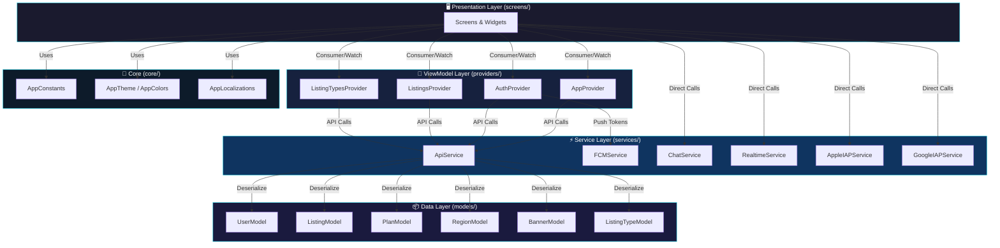
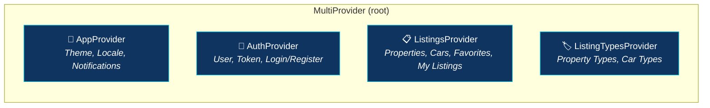
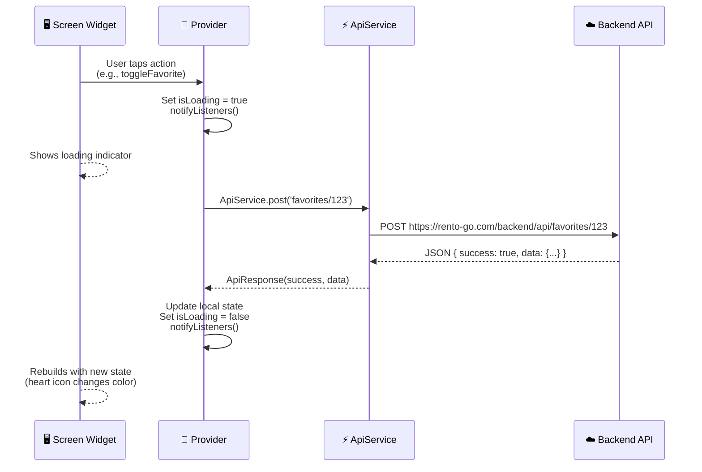
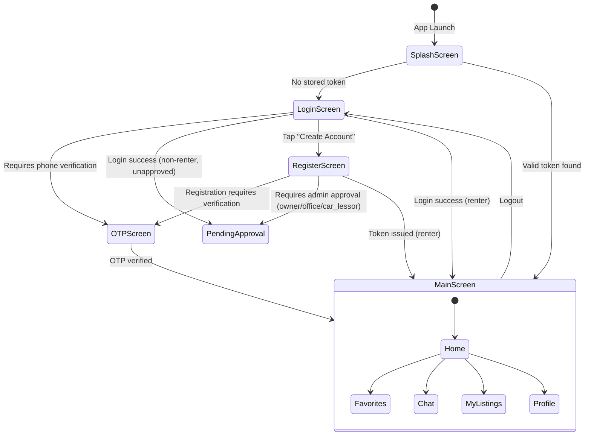
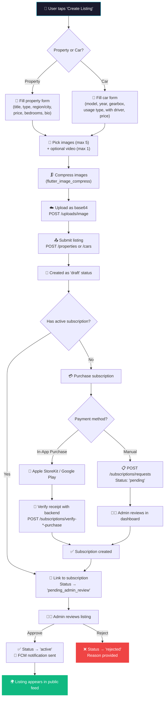
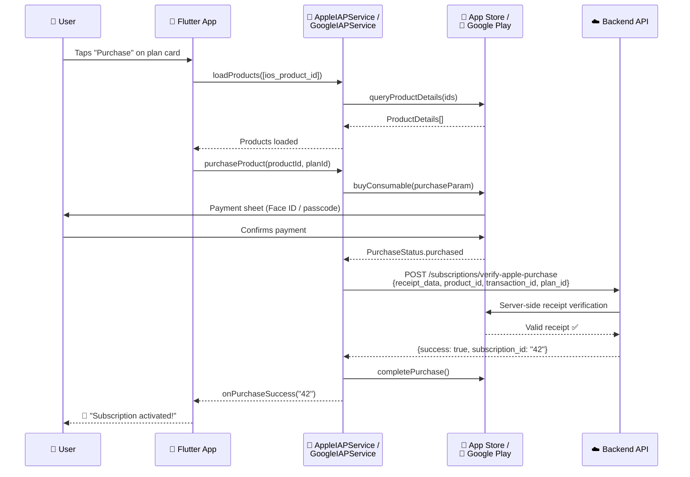

<


</div>

---

## 📋 Table of Contents

- [Executive Summary](#-executive-summary)
- [Architecture Deep-Dive](#-architecture-deep-dive)
- [The Tech Stack](#-the-tech-stack)
- [State Management Logic](#-state-management-logic)
- [Critical Workflows](#-critical-workflows)
- [Setup & Environment](#-setup--environment)
- [Potential Technical Debt](#-potential-technical-debt)

---

## 🎯 Executive Summary

**RentoGo** is a mobile-first classified marketplace that connects **property owners**, **car lessors**, and **real estate offices** with **renters** in the Palestinian and Israeli market.

### What Problem Does It Solve?

| Problem | RentoGo's Solution |
|---------|-------------------|
| 🔀 **Fragmented listings** scattered across WhatsApp groups, Facebook, and flyers | A single searchable, filtered marketplace |
| 🌍 **No trilingual support** (Arabic, Hebrew, English) with proper RTL | Full trilingual UI with automatic RTL/LTR switching |
| 🚫 **No quality control** on listings | Admin-approval workflow before listings go live |
| 💰 **No monetization layer** for listers | Subscription-based model with tiered plans (Bronze/Silver/Gold) |

### Business Model

RentoGo operates on a **freemium/subscription model**:
- **Free**: Browse and search all listings, register, create draft listings.
- **Paid**: Subscription plans (single or bundled packages) required to publish and activate listings.
- **Revenue**: 100% from subscription fees. No commission on rental transactions.
- **Payment Channels**: In-App Purchase (Apple/Google) + Admin-verified manual payments.
- **Currency**: Israeli New Shekel (₪ / ILS) only.

### Target Audience

| Persona | Role |
|---------|------|
| 🔍 **Renter** (مستأجر) | Browses, filters, and contacts owners about available rentals |
| 🏘️ **Property Owner** (مالك عقار) | Lists apartments, villas, student housing, land, commercial spaces |
| 🚗 **Car Lessor** (مؤجر سيارات) | Lists vehicles for daily, wedding, or tourism rental |
| 🏢 **Office** (مكتب عقارات) | Professional agency managing multiple listings |
| ⚙️ **Admin** (مدير النظام) | Moderates listings, manages users, configures plans |

---

## 🏗️ Architecture Deep-Dive

### Architectural Pattern: **Modified MVVM** (Provider-based)

The app uses a **Model-View-ViewModel** pattern adapted to Flutter with `Provider`. The codebase is organized into a clean, layered structure — though it's not strict Clean Architecture, it maintains a clear separation of concerns.



### 📁 Folder Structure

```
lib/
├── main.dart                       # App entry point, MultiProvider setup, MaterialApp config
│
├── core/                           # 🔧 Foundation layer — app-wide configuration
│   ├── constants/
│   │   └── app_constants.dart      # API URLs, limits (maxImages=5), pagination, currency
│   ├── localization/
│   │   └── app_localizations.dart  # 47KB custom localization (AR/EN/HE) with 200+ keys
│   └── theme/
│       ├── app_colors.dart         # Design tokens: primary (teal #00BCD4), dark/light palette
│       └── app_theme.dart          # Material 3 light/dark ThemeData, Google Fonts (Cairo)
│
├── models/                         # 📦 Data layer — immutable data classes
│   ├── user_model.dart             # User entity with fromJson/toJson, role-based permissions
│   ├── listing_model.dart          # Unified property/car model, trilingual getters, status helpers
│   ├── plan_model.dart             # Subscription plans with IAP product IDs (iOS & Android)
│   ├── region_model.dart           # Hierarchical region → city with trilingual names
│   ├── banner_model.dart           # Admin-configured promotional banners
│   └── listing_type_model.dart     # Enum-like type definitions (apartment, villa, daily, wedding...)
│
├── providers/                      # 🧠 ViewModel / State management layer
│   ├── app_provider.dart           # Theme, locale, notification toggle — persisted via SharedPrefs
│   ├── auth_provider.dart          # Login/register/logout, JWT token management, FCM topic subscription
│   ├── listings_provider.dart      # Properties/cars lists, favorites, my-listings, filters, pagination
│   └── listing_types_provider.dart # Property/car type taxonomy fetched from API
│
├── services/                       # ⚡ Service layer — external integrations
│   ├── api_service.dart            # HTTP client wrapper (GET/POST/PUT/DELETE), JWT headers, error translation
│   ├── fcm_service.dart            # Firebase Cloud Messaging: init, token, foreground/background handlers
│   ├── apple_iap_service.dart      # iOS StoreKit: purchase flow, receipt verification with backend
│   ├── google_iap_service.dart     # Google Play Billing: purchase flow, token verification with backend
│   ├── chat_service.dart           # Thin API wrapper for conversations endpoint
│   └── realtime_service.dart       # Polling-based realtime service (2s interval) for chat messages
│
└── screens/                        # 🖥️ Presentation layer — UI screens
    ├── splash_screen.dart          # Animated splash with auth check → Login or MainScreen
    ├── main_screen.dart            # Bottom nav shell: Home, Favorites, Chat, My Listings, Profile
    │
    ├── auth/                       # Authentication flow (5 screens)
    │   ├── login_screen.dart
    │   ├── register_screen.dart
    │   ├── forgot_password_screen.dart
    │   ├── otp_screen.dart
    │   └── reset_password_screen.dart
    │
    ├── home/
    │   └── home_screen.dart        # Main feed: banners, category chips, property/car tab views
    │
    ├── search/                     # Search with filters (region, city, type)
    ├── listing_details/            # Full listing view with image gallery, contact CTAs
    ├── add_listing/                # Multi-step form: property or car listing creation
    ├── edit_listing/               # Edit existing listings
    ├── my_listings/                # User's own listings management (status, pause, renew)
    ├── favorites/                  # Saved listings
    ├── chat/                       # Conversations list + individual chat screen
    ├── packages/                   # Subscription plan browsing & purchase flow
    ├── checkout/                   # IAP checkout (Apple StoreKit / Google Play Billing)
    ├── notifications/              # Push notification history
    ├── banner_details/             # Promotional banner detail view
    ├── profile/                    # Profile settings, edit profile, my subscriptions
    │
    └── widgets/                    # Shared/reusable widget library
        ├── listing_card.dart       # Standard listing card (list view)
        ├── grid_listing_card.dart  # Grid layout listing card
        ├── category_chips.dart     # Horizontal filter chips (property types, car usage types)
        ├── search_bar_widget.dart  # Header search bar
        ├── admin_banner_widget.dart # Auto-scrolling banner carousel
        ├── cta_banner.dart         # Calls-to-action promotional banner
        └── subscription_warning_banner.dart # Subscription expiry/limit warnings
```

### Layer Responsibilities

| Layer | Directory | Responsibility |
|-------|-----------|---------------|
| **Core** | `lib/core/` | Constants, theming (Material 3, dark/light), trilingual localization (AR/EN/HE) |
| **Models** | `lib/models/` | Immutable Dart data classes with `fromJson` factories. Null-safe parsing. No business logic beyond formatting helpers. |
| **Providers** | `lib/providers/` | `ChangeNotifier` classes that hold UI state, orchestrate API calls, and expose getters to the presentation layer |
| **Services** | `lib/services/` | Stateless utility classes for external I/O: HTTP, FCM, In-App Purchase, Chat polling |
| **Screens** | `lib/screens/` | Flutter widgets organized by feature. Each feature folder contains screen(s) and feature-specific widgets |

---

## 🛠️ The Tech Stack

### Core Dependencies

| Category | Package | Version | Purpose | Why This Choice? |
|----------|---------|---------|---------|-----------------|
| **State Management** | `provider` | ^6.1.1 | `ChangeNotifier`-based reactive state | Lightweight, Flutter-recommended, easy to learn. Ideal for apps without deeply nested state trees. |
| **Navigation** | `go_router` | ^13.0.0 | Declarative routing (declared but `Navigator.push` used in practice) | Likely added for future deep-linking support. Currently unused — the app navigates imperatively. |
| **HTTP Client** | `http` | ^1.2.0 | Primary REST API client | Simple, no-dependency HTTP client. Sufficient for straightforward REST calls. |
| **HTTP Client** | `dio` | ^5.4.0 | Advanced HTTP (declared but unused in code) | Likely added for future multipart uploads or interceptors. Currently not imported anywhere. |
| **Local Storage** | `shared_preferences` | ^2.2.2 | Persists auth token, theme, language, settings | Simple key-value storage for non-sensitive data. |
| **Secure Storage** | `flutter_secure_storage` | ^9.0.0 | Declared but not used in codebase | Likely intended for JWT tokens but `SharedPreferences` is used instead. |
| **Push Notifications** | `firebase_core` + `firebase_messaging` | ^2.25.4 / ^14.7.15 | Firebase Cloud Messaging (FCM) | Industry standard for cross-platform push notifications. |
| **Local Notifications** | `flutter_local_notifications` | ^17.0.0 | Foreground notification display | Required to show notifications when app is in foreground (FCM doesn't do this natively). |
| **In-App Purchase** | `in_app_purchase` | ^3.1.13 | iOS StoreKit + Google Play Billing | Official Flutter plugin for cross-platform IAP with unified API. |
| **Image Handling** | `image_picker` | ^1.0.7 | Camera/gallery image selection | Standard Flutter image picking. |
| **Image Compression** | `flutter_image_compress` | ^2.1.0 | Client-side image compression before upload | Reduces upload size — critical on shared hosting with upload limits. |
| **Image Caching** | `cached_network_image` | ^3.3.1 | Disk-cached network images with placeholders | Prevents re-downloading images, improves scroll performance. |
| **UI / Typography** | `google_fonts` | ^6.1.0 | Cairo font family (Arabic-optimized) | Cairo supports Arabic, Hebrew, and Latin scripts — perfect for a trilingual RTL app. |
| **SVG** | `flutter_svg` | ^2.0.9 | Vector asset rendering | Used for icons and illustrations in SVG format. |
| **Shimmer** | `shimmer` | ^3.0.0 | Loading skeleton placeholders | Polished UX during API loading states. |
| **Image Viewer** | `photo_view` | ^0.14.0 | Zoomable image gallery | Full-screen pinch-to-zoom for listing photos. |
| **Video** | `video_player` | ^2.8.2 | Listing video playback | Supports video media attached to listings. |
| **Forms** | `flutter_form_builder` + `form_builder_validators` | ^10.1.0 / ^11.0.0 | Complex form management with validation | Rich form widgets and declarative validation — simplifies the listing creation forms. |
| **Internationalization** | `intl` | any | Date/number formatting | Used with custom `AppLocalizations` for trilingual support. |
| **Deep Links / Sharing** | `url_launcher` + `share_plus` | ^6.2.4 / ^7.2.2 | Open URLs, share listings | Contact via WhatsApp, phone calls, sharing listing links. |
| **Phone Calls** | `flutter_phone_direct_caller` | ^2.1.1 | Direct phone call initiation | One-tap call to listing owner. |

### Backend Stack (Not in this repo)

| Component | Technology |
|-----------|-----------|
| **API** | PHP 8.4 (no framework, custom router) |
| **Database** | MariaDB 10.11.15 |
| **Admin Dashboard** | PHP + HTML/CSS/JS (server-rendered) |
| **Hosting** | Shared cPanel (Apache) |
| **Domain** | `rento-go.com` |

---

## 🔄 State Management Logic

### Provider Architecture

RentoGo uses **Provider** with `ChangeNotifier` — a straightforward MVVM approach. There are **4 global providers** registered at the root of the widget tree via `MultiProvider`:



### Provider Roles & State Ownership

| Provider | State Owned | Persisted? | Key Methods |
|----------|------------|------------|-------------|
| **`AppProvider`** | `themeMode`, `locale`, `notificationsEnabled` | ✅ SharedPrefs | `toggleTheme()`, `setLocale()`, `setNotificationsEnabled()` |
| **`AuthProvider`** | `user` (UserModel), `token` (JWT), `isLoading`, `isInitialized` | ✅ SharedPrefs | `login()`, `register()`, `logout()`, `refreshUser()`, `forgotPassword()`, `verifyPhone()` |
| **`ListingsProvider`** | `properties[]`, `cars[]`, `favorites[]`, `myListings[]`, filter state, pagination cursors | ❌ Memory only | `fetchProperties()`, `fetchCars()`, `fetchFavorites()`, `toggleFavorite()`, `setFilters()` |
| **`ListingTypesProvider`** | `propertyTypes[]`, `carTypes[]` | ❌ Memory only | `fetchTypes()`, cached with `_hasLoaded` flag |

### Data Flow: UI Action → Backend → UI Update



### Key Design Decisions

1. **No Repository Layer**: Providers call `ApiService` directly — there is no abstraction between state and network.
2. **Immutable Models**: All models use `final` fields and `factory fromJson` constructors. State updates require creating new model instances (see `_updateFavoriteStatus` in `ListingsProvider`).
3. **Error Handling via Exceptions**: Providers `throw Exception(message)` on failure; UI catches with `try/catch` and shows `SnackBar`.
4. **Client-Side i18n for API Errors**: `ApiService._translateMessage()` maps English API error strings to Arabic for display.

---

## 🔑 Critical Workflows

### 1. 🔐 Authentication Flow

The authentication system uses **JWT tokens** with phone/email login, role-based access, and optional OTP verification.



**Key Details:**
- **Token Storage**: JWT saved in `SharedPreferences` (key: `auth_token`), user JSON alongside.
- **Auto-Login**: `AuthProvider` constructor calls `_loadUser()` which restores token/user from SharedPrefs.
- **FCM Subscription**: On successful login (Android), user subscribes to FCM topics: `user_type_{userType}` and `all_users`.
- **Forced Auth**: `SplashScreen._initializeApp()` redirects unauthenticated users to `LoginScreen` — the app requires login.
- **Error Translation**: Login/register errors from the English API are translated to Arabic client-side via `_translateLoginError()` and `_translateRegisterError()`.

---

### 2. 📝 Listing Creation & Subscription Activation

This is the most complex workflow — it bridges listing content creation with the monetization (subscription) system.



**Listing Status Lifecycle:**

| Status | Meaning |
|--------|---------|
| `draft` | Created but no subscription linked |
| `pending_payment` | Awaiting subscription purchase |
| `pending_admin_review` | Subscription linked, awaiting admin approval |
| `active` | Live and visible in public feed |
| `paused` | Temporarily hidden by owner |
| `expired` | Subscription period ended |
| `rejected` | Admin rejected with reason |

---

### 3. 💳 In-App Purchase Flow (iOS + Android)

RentoGo implements **dual-platform IAP** with server-side receipt verification.



**Platform-Specific Details:**

| Aspect | iOS (Apple) | Android (Google) |
|--------|-------------|-----------------|
| Service Class | `AppleIAPService` | `GoogleIAPService` |
| Purchase Type | Consumable (non-auto-renewing) | Consumable (non-auto-renewing) |
| Verification Endpoint | `POST /subscriptions/verify-apple-purchase` | `POST /subscriptions/verify-google-purchase` |
| Verification Data | `receipt_data` (StoreKit receipt) | `purchase_token` (Billing client token) |
| Auto-Consume | `false` — consumed after backend verification | `false` — consumed after backend verification |
| Singleton | `AppleIAPService._instance` | `GoogleIAPService._instance` |
| StoreKit Delegate | `PaymentQueueDelegate` (always continues transactions) | N/A |

---

## ⚙️ Setup & Environment

### Prerequisites

| Tool | Version | Notes |
|------|---------|-------|
| **Flutter SDK** | ≥ 3.8.1 | `flutter --version` to verify |
| **Dart SDK** | ≥ 3.8.1 | Bundled with Flutter |
| **Xcode** | Latest | iOS builds only (macOS required) |
| **Android Studio** | Latest | Android builds, emulator |
| **CocoaPods** | Latest | iOS native dependencies |
| **XAMPP** *(optional)* | 8.x | Local backend development |

### Step-by-Step Setup

#### 1️⃣ Clone & Install Dependencies

```bash
git clone <repository-url>
cd rento-main
flutter pub get
```

#### 2️⃣ Firebase Configuration

The project requires two Firebase config files (already present in repo root — **verify they're current**):

| File | Location | Purpose |
|------|----------|---------|
| `google-services.json` | `android/app/google-services.json` | Android FCM |
| `GoogleService-Info.plist` | `ios/Runner/GoogleService-Info.plist` | iOS FCM |

> ⚠️ **Security Note**: These files are committed to repo root. Ensure any sensitive Firebase Admin SDK JSON files (`rentogo-3fa22-firebase-adminsdk-*.json`) are **not** deployed to production mobile builds.

#### 3️⃣ API Environment Configuration

Edit `lib/core/constants/app_constants.dart`:

```dart
// 🔴 PRODUCTION (default):
static const String baseUrl = 'https://rento-go.com/backend/api';
static const String uploadUrl = 'https://rento-go.com/uploads/';

// 🟢 LOCAL DEVELOPMENT (Android Emulator):
// static const String baseUrl = 'http://10.0.2.2/rento_go/backend/api';
// static const String uploadUrl = 'http://10.0.2.2/rento_go/uploads/';
```

> **⚠️ IMPORTANT**: There is no `.env` file, no build flavors, and no runtime environment switching. The API URL is a **hardcoded constant**. You must manually toggle comments for local vs. production.

#### 4️⃣ iOS Setup

```bash
cd ios
pod install
cd ..
flutter build ios
```

**Required Xcode Configurations:**
- Bundle ID must match Firebase project.
- Push Notification capability must be enabled.
- In-App Purchase capability must be enabled.
- Background Modes → Remote Notifications must be checked.

#### 5️⃣ Android Setup

```bash
flutter build apk --release
# or for App Bundle (store submission):
flutter build appbundle --release
```

**Required setup:**
- `minSdkVersion`: 21 (Android 5.0)
- Signing config in `android/app/build.gradle` (keystore required for release builds).
- FCM requires `google-services.json` in `android/app/`.

#### 6️⃣ Run in Development

```bash
# Android Emulator
flutter run -d emulator-5554

# iOS Simulator
flutter run -d "iPhone 15 Pro"

# Debug with verbose logging
flutter run --verbose
```

### Hidden Configuration Checklist

| Item | Location | Notes |
|------|----------|-------|
| API Base URL | `lib/core/constants/app_constants.dart` | Comment toggle (no env files) |
| Firebase Android | `android/app/google-services.json` | Must match Firebase project |
| Firebase iOS | `ios/Runner/GoogleService-Info.plist` | Must match Firebase project |
| iOS IAP Product IDs | Backend `plans` table → `ios_product_id` | Must match App Store Connect |
| Android IAP Product IDs | Backend `plans` table → `android_product_id` | Must match Google Play Console |
| JWT Secret | Backend `config/constants.php` | Backend-only; shared between API and admin dashboard |
| App Icon | `assets/images/appicon.png` | Generated via `flutter_launcher_icons` |

---

## ⚠️ Potential Technical Debt

### 🔴 High Priority

| # | Issue | Location | Impact | Recommendation |
|---|-------|----------|--------|----------------|
| 1 | **JWT token stored in SharedPreferences** | `auth_provider.dart:186` | Tokens are stored unencrypted in plaintext. On rooted/jailbroken devices, they can be extracted. | Migrate to `flutter_secure_storage` (already in `pubspec.yaml` but unused). |
| 2 | **No environment/flavor configuration** | `app_constants.dart` | Developers must manually toggle comments between production and local URLs. Risk of accidentally shipping debug URLs to production. | Implement `--dart-define` flags or `.env` files with `flutter_dotenv`. |
| 3 | **`go_router` declared but entirely unused** | `pubspec.yaml` | Dead dependency. All navigation uses imperative `Navigator.push`. Adds unnecessary package weight. | Either migrate to `go_router` (for deep linking) or remove it from `pubspec.yaml`. |
| 4 | **`dio` declared but entirely unused** | `pubspec.yaml` | Dead dependency. The app uses `http` package exclusively. | Remove `dio` from dependencies or migrate to `dio` for interceptor/retry support. |
| 5 | **Hardcoded upload URL in model** | `listing_model.dart:382` | `'https://rento-go.com/uploads/$filePath'` is hardcoded in `_parseImages()`. Will break on any domain change. | Use `AppConstants.uploadUrl` instead. |
| 6 | **FCM only initialized on Android** | `main.dart:29`, `auth_provider.dart:190` | iOS users do not get FCM token saved to server, so they won't receive targeted push notifications (topic-based ones may still work). | Add iOS FCM token support after notification permission is granted. |

### 🟡 Medium Priority

| # | Issue | Location | Impact | Recommendation |
|---|-------|----------|--------|----------------|
| 7 | **Immutable model update is verbose** | `listings_provider.dart:201-260` | Toggling `isFavorite` requires manually reconstructing the entire `ListingModel` with all fields. Error-prone and hard to maintain. | Add a `copyWith()` method to `ListingModel` or use `freezed` package. |
| 8 | **Verbose debug logging in production** | `api_service.dart:36,45,59,60,74,75,111,112` | Every API request/response body is printed via `debugPrint`. Can leak sensitive data in console logs. | Gate behind `kDebugMode` or use a proper logging framework. |
| 9 | **No retry/exponential backoff** | `api_service.dart` | API calls have a 30s timeout but no retry logic. Flaky networks cause silent failures. | Add retry logic with exponential backoff (easy with `dio` interceptor). |
| 10 | **Missing `copyWith` on all models** | `models/` | Cannot efficiently create modified copies of model instances. | Generate with `freezed` or add manually. |
| 11 | **Localization is a single 47KB file** | `app_localizations.dart` | All 200+ translation keys for 3 languages in one file. Hard to maintain and review. | Split into per-language `.arb` files and use `flutter_localizations` code generation. |
| 12 | **No unit or widget tests** | `test/` | Zero test coverage. Regressions are caught only through manual testing. | Start with unit tests for providers and model parsing. |

### 🟢 Low Priority / Improvements

| # | Issue | Location | Impact | Recommendation |
|---|-------|----------|--------|----------------|
| 13 | **Polling-based chat** | `realtime_service.dart` | 2-second polling interval increases server load and battery drain. A `websocket-server.php` exists in the repo but isn't integrated. | Migrate to WebSocket when backend infrastructure supports it. |
| 14 | **Base64 image uploads** | Image upload flow | Adds ~33% overhead to every image upload. Subject to PHP `post_max_size` limits. | Switch to multipart form upload (endpoint `POST /uploads/images` already exists). |
| 15 | **No offline support** | Entire app | App shows empty state without internet. No cached data persists between sessions (except auth). | Add SQLite/Hive for offline listing cache. |
| 16 | **Lots of unrelated files in project root** | Project root | `.sql`, `.xlsx`, `.pptx`, `.jpeg`, `.pdf` files clutter the repository root. | Move to a `docs/` or `assets/` folder, or add to `.gitignore`. |
| 17 | **Firebase Admin SDK keys in repo root** | `rentogo-*-firebase-adminsdk-*.json` | These are server-side credentials committed to the repo. Security risk if repo becomes public. | Move to a secrets manager or at minimum add to `.gitignore`. |

---

<div align="center">

**Built with ❤️ using Flutter**

`v1.1.0+19` · Dart SDK ≥ 3.8.1 · Last documented: April 2026

</div>
]]>
